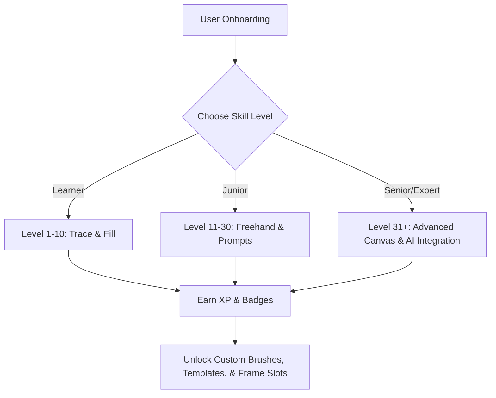
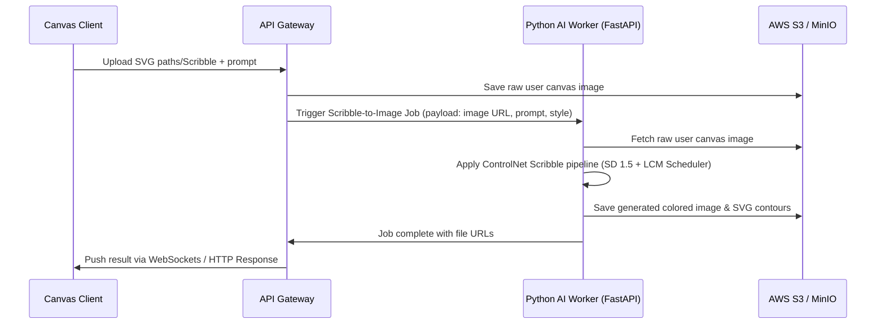
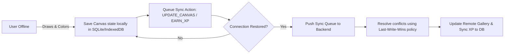

# Chitrai: Gamified Art Learning & Sketching Platform
## Project Context & Technical Specification

Chitrai (meaning *art/painting*) is an interactive, gamified web and mobile application designed to help budding artists learn to draw, color, and express their creativity. It bridges the gap between structured art education and creative play, featuring three progressive skill tiers (Learner, Junior, and Senior/Expert), offline-first capabilities, and open-source Generative AI tools to guide and inspire users.

---

## 1. Product Vision & Gamification

Chitrai is structured like an interactive game. Instead of standard tutorials, users complete quests, unlock levels, and earn badges by practicing their drawing, shading, coloring, and animation skills.



### 1.1 Gamification Engine
- **XP (Experience Points):** Awarded for stroke precision, color harmony (using simple algorithms), completing daily challenges, and creating multi-frame animations.
- **Streaks & Daily Quests:** Encourages daily practice (e.g., "Draw a mythical animal in 5 minutes").
- **Interactive Feedback:** Real-time visual feedback (e.g., confetti on completing a boundary, glowing strokes for correct tracing).
- **Public/Private Gallery:** Create personal digital sketchbooks or publish to the community gallery.

---

## 2. User Persona Matrix & Features

| Feature / Capability | **Learner (Level 1-10)** | **Junior (Level 11-30)** | **Senior / Expert (Level 31+)** |
| :--- | :--- | :--- | :--- |
| **Core Goal** | Learn hand-eye coordination, basic shapes, and color theory. | Develop freehand sketching, storyboarding, and prompt-based drawing. | Master complex compositions, custom styles, and AI collaboration. |
| **Drawing Mode** | Guided tracing of simple sketches with snapping/magnetic brush options. | Freehand sketching on clean grids or template prompts. | Complete canvas freedom with layer support, vector tools, and custom brushes. |
| **Coloring** | Tap-to-fill (flood fill) with curated, harmonious color palettes. | Gradient tools, manual coloring brush with opacity control. | Full color wheel, layer blending modes (multiply, overlay), and palette extraction. |
| **AI Integration** | None (focused on building muscle memory and core control). | **AI Sketch-to-Sketch:** Auto-complete/clean up rough sketches or generate a outline from a story prompt. | **AI Text-to-Sketch & Style Transfer:** Generate high-detail reference outlines or transfer custom styles. |
| **Animation** | Simple flipbook mode (3-5 frames) with auto-onion skinning. | Keyframe animation (up to 12 frames) with motion path assistance. | Multi-layer frame-by-frame animation, custom framerates, and audio track linking. |
| **Sharing & Album** | Local device album + Share to social platforms (Meta, Insta, TikTok). | Online personal album + Community showcase + Social sharing. | Custom portfolio subdomains + High-res export + Webhook exports to external storage. |

---

## 3. System Architecture & Tech Stack

To ensure that both the web app (desktop & mobile browsers) and native mobile apps (Android, iOS) share a unified UI/UX, codebase structure, and logic, the following stack is specified:

```mermaid
flowchart TD
    subgraph Frontend [Unified Client Application]
        A[React Native Web / Expo] --> B[HTML5 Canvas / Expo 2D Canvas]
        A --> C[Redux Toolkit + RTK Query Client-side State]
        A --> D[IndexedDB / SQLite Offline Storage]
    end
    
    subgraph Cloud Gateway [API & Routing]
        E[AWS CloudFront / Vercel Edge] --> F[Kong API Gateway / Nginx]
    end
    
    subgraph Services [Backend Services]
        F --> G[Node.js / Express Core Service: Auth, Profiles, Gamification]
        F --> H[Python / FastAPI AI Inference Microservice]
        F --> I[Redis Sync Queue & Session Caching]
    end
    
    subgraph Storage [Database & Object Layer]
        G --> J[PostgreSQL: Users, Progress, Gallery Metadata]
        H --> K[MinIO / AWS S3: Images, Sketches, SVG Frames]
    end

    Frontend <-->|REST / WebSockets| Cloud Gateway
```

### 3.1 Technology Stack Details

*   **Frontend Framework:** **React Native Web (via Expo)**.
    *   *Rationale:* Compiles to a responsive Web App supporting Windows, macOS, iOS, and Android. Guarantees 95%+ code sharing between the web and mobile wrappers.
*   **Drawing & Canvas Engine:** **Fabric.js (for Web)** or a custom wrapper on top of **React Native SVG / Canvas**.
    *   *Rationale:* Supports layered canvases, undo/redo histories, and vector formats (SVG) which make it easy to export clean paths to the AI model.
*   **Backend Core Service:** **Node.js (TypeScript) with Express or NestJS**.
    *   *Rationale:* High concurrency handling for client interactions, event-based socket communication, and standard REST APIs.
*   **AI Microservice:** **Python (FastAPI)**.
    *   *Rationale:* Direct binding to ML libraries (PyTorch, Diffusers, OpenCV) for image processing and inference.
*   **Database:** **PostgreSQL** with `pgvector` extension.
    *   *Rationale:* Handles relational data (levels, user accounts, purchases) while allowing vector searches (e.g., finding similar sketches drawn by other users).
*   **Authentication:** **Firebase Authentication** or **Supabase Auth**.
    *   *Rationale:* Simplifies phone number, email/password, and Google OAuth flow out-of-the-box with SDKs for both web and mobile platforms.

---

## 4. AI Engine Workflow (Open Source Models)

Chitrai uses local or self-hosted open-source AI pipelines. No commercial cloud APIs (like Midjourney or DALL-E) are used to keep cost low and allow custom model fine-tuning.

### 4.1 AI Pipelines

1.  **Text-to-Sketch (Prompt-based sketch generation):**
    *   *Model:* **Stable Diffusion XL (SDXL)** or **SD 2.1** with a specialized **Sketch Lora** (e.g., Anime Sketch or Pencil Sketch).
    *   *Function:* Generates outlines for Juniors and Experts based on story prompts.
2.  **Sketch-to-Image / Coloring (Render user drawings):**
    *   *Model:* **Stable Diffusion 1.5 + ControlNet (Scribble/Lineart)**.
    *   *Function:* Takes the user's vector/raster sketch as a control image and generates a fully-rendered, colored image matching the style requested by the user.
3.  **Sketch Refinement (Auto-beautification):**
    *   *Model:* Custom lightweight autoencoder or **ControlNet HED boundary detection** to smooth hand-drawn strokes into clean vector contours.



---

## 5. Offline-First & Synchronization Strategy

A core requirement is that Chitrai must function seamlessly offline, letting kids sketch on tablets or mobile phones without internet connection.

### 5.1 Client Storage
- **Canvas State:** Drawings are stored as JSON/SVG strings in **IndexedDB** (for web) and **SQLite/WatermelonDB** (for native mobile apps).
- **Asset Cache:** Templates, brushes, and offline-accessible background music/sound effects are cached using standard **Service Workers (Cache API)** on web and a local cache directory on mobile.

### 5.2 Synchronization Pipeline



---

## 6. Monetization Framework

Chitrai maintains a freemium model with pricing tiers scaled to resources consumed (specifically AI generation and cloud storage).

| Tier | Cost | Target | Features Included | Limits |
| :--- | :--- | :--- | :--- | :--- |
| **Free Tier** | $0 | Casual Learners | - 20+ basic trace outlines<br>- Tap-to-fill coloring tool<br>- Save up to 5 sketches locally | - No AI features<br>- No cloud backup/albums<br>- Ad-supported community gallery |
| **Premium Tier** | $4.99/mo | Passionate Juniors & Experts | - Unlimited local & cloud sketches<br>- 50 AI image colorizations/mo<br>- Custom brush engine<br>- Ad-free experience | - 50 AI Generations / mo<br>- Max 5GB Cloud Storage |
| **Art Master Tier** | $14.99/mo | Power Creators | - Everything in Premium<br>- Unlimited AI generations (Relaxed GPU queue)<br>- Custom Portfolio subdomains<br>- Multi-layer animation exports | - Unlimited AI Generations<br>- Max 50GB Cloud Storage |

---

## 7. Development Roadmap & Milestones

*   **Phase 1: Core Engine (Offline Canvas & Gamification)**
    *   Setup Mono-repo (React Native Web + Express Core Backend).
    *   Build standard HTML5 drawing canvas with basic brush, erase, color, undo/redo features.
    *   Implement local IndexedDB storage and offline fallback.
*   **Phase 2: AI Pipeline & Backend Integration**
    *   Setup Python FastAPI AI Microservice with Stable Diffusion + ControlNet.
    *   Create Firebase/Google OAuth authentication flows.
    *   Connect client canvas to AI API for sketch coloring and outlines.
*   **Phase 3: Leveling & Community Features**
    *   Create gamification engines (XP, quests, streaks).
    *   Build online portfolio galleries and sharing triggers to Meta/TikTok.
*   **Phase 4: Release & Optimization**
    *   Optimize canvas for lag-free mobile/desktop performance.
    *   Setup PWA packaging and deploy desktop wrappers (Electron) or native app packages.
